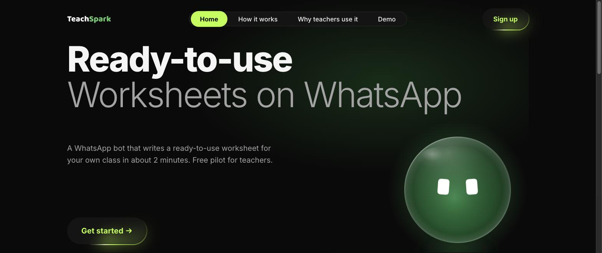
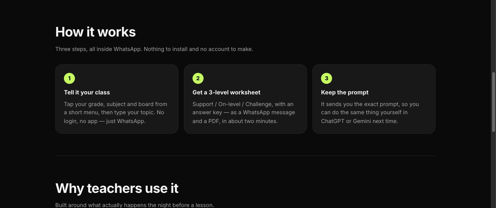
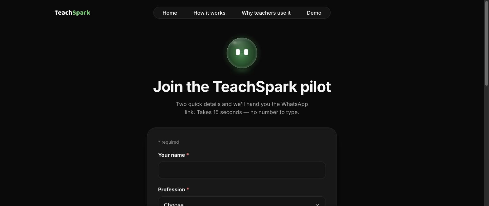
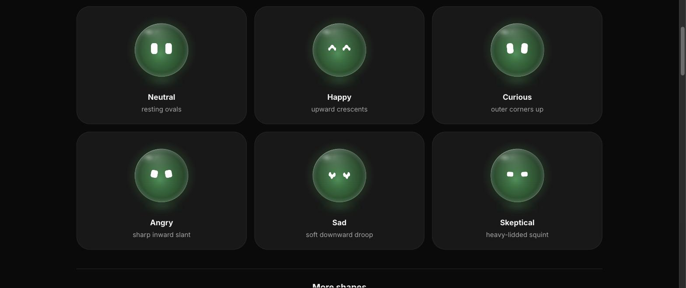

<p align="center">
  
</p>

<p align="center"><strong>Ready-to-use worksheets for your class — on WhatsApp.</strong></p>

<p align="center">A WhatsApp bot that turns a topic into a differentiated worksheet, or a textbook chapter into a question paper, in about two minutes. No app, no login.</p>

<p align="center">
  = 24.15">
  
  
</p>

TeachSpark helps a time-poor Indian K–12 teacher use AI for real classroom work. She sends a WhatsApp
message, taps her grade, subject and board from a short menu, types a topic, and gets back a
**differentiated worksheet for her own class** — a WhatsApp message and a PDF, with the answer key and
the exact prompt so she can do it herself next time. It's built as the MVP for a product case study and
runs a live pilot with real teachers. This repo is a monorepo: an Express + Twilio + Claude bot, and a
Vite/React landing PWA that recruits teachers into the pilot.

## Highlights

- **Worksheets on WhatsApp** — grade / subject / board from a menu, then a topic, and back comes a 3-level worksheet (Support · On-level · Challenge) with an answer key, as a chat message and a PDF, in ~2 minutes.
- **Question papers from photos** — text `PAPER`, send photos of a textbook chapter, and get a complete question paper as an editable Word (`.docx`) file, answer key included.
- **Two built-in skills** — the differentiated worksheet and an exit-ticket **quiz**, each with its own guided flow.
- **Keeps the prompt** — every result ships with the exact prompt used, so a teacher can reproduce it in ChatGPT or Gemini next time.
- **Pure state-machine core** — `transition()` is a pure `(teacher, message, now) → { updates, events, actions }` function with no I/O; an executor performs the side effects. Deterministic and unit-tested.
- **No app, no login** — the whole thing lives inside WhatsApp via Twilio, and it never asks for student data by design.
- **Re-engagement nudges** — a timezone-aware `node-cron` job gently re-opens the conversation with teachers who went quiet.
- **Installable landing PWA** — a React 19 + Vite marketing site with an animated "Spark" mascot (a parametric expressive-eyes engine), Open Graph cover, and an offline service worker.
- **Admin funnel dashboard** — a token-gated `/admin` view with a signup funnel and an India map of where teachers are joining, backed by Mixpanel + Clarity analytics.

## Screenshots

> TeachSpark ships a single **dark** theme — neon-lime on near-black, contrast-tuned; there is no light mode to toggle, so these are the real UI. Captured from the landing PWA running locally.

### Landing — the hero


### How it works — three steps, all inside WhatsApp


### Demo — the full walkthrough in a phone frame


### Join — the pilot signup


### Spark Lab — the mascot's expression set


## Getting started

**Prerequisites:** Node.js ≥ 24.15 and npm.

```bash
git clone https://github.com/007U5H4R/teachspark.git
cd teachspark
npm install
cp .env.example .env   # fill in Twilio, Anthropic and Supabase credentials
```

Run just the **landing PWA** (no credentials needed):

```bash
npm run dev:web        # Vite dev server → http://localhost:5173
```

Run the **full bot** (needs a filled-in `.env`):

```bash
npm run dev            # Express API on :3000, serves the PWA and the Twilio webhook
```

Build and start for **production**:

```bash
npm run build          # builds the PWA (needs PUBLIC_BASE_URL) and compiles the API to dist/
npm start              # node dist/index.js
```

Setup, environment variables, deployment and operations are documented in
[`docs/runbook.md`](docs/runbook.md); pilot recruiting material lives in [`docs/pilot/`](docs/pilot/).

## How it works

- **Transport → brain → hands.** Twilio delivers a signed POST to an Express 5 webhook (`src/http/app.ts`); the pure state machine (`src/bot/machine.ts`) decides *what* should happen; an executor performs the actions (call Claude, build the file, send the reply).
- **Generation.** Claude (Sonnet) writes the worksheet, quiz or paper; **PDFKit** renders the PDF and the **`docx`** library renders the Word file.
- **Storage.** Supabase Postgres holds teachers, events and generations; Supabase Storage buckets hold the generated PDFs and Word files.
- **Runtime.** Deploys to Railway (`railway.json`); a `node-cron` job runs the re-engagement nudge pass, and the landing PWA is served as static assets from the same app.

## Development

```bash
npm run typecheck      # tsc for the API and the web workspace
npm test               # vitest — both the `api` and `web` projects
npm run test:api       # API tests only
npm run test:web       # web tests only
npm run dev:web        # Vite dev server for the landing PWA
```

Handy one-off scripts: `npm run try:generate` (worksheet), `npm run try:paper` (question paper) and
`npm run brand:assets` (regenerate the brand bitmaps).

## Credits & license

- Built as the MVP for a product case study; running a live pilot with real teachers.
- Powered by [Claude](https://www.anthropic.com/claude), Twilio WhatsApp, Supabase and Railway.
- Fonts: **Inter** and **Baloo 2**, both under the SIL Open Font License — see [`assets/fonts/OFL.txt`](assets/fonts/OFL.txt).
- No license file is included; this is a private case-study MVP, not an open-source release. All rights reserved by the author.

> **Note (private repo):** on a private GitHub repository the images above are served through short-lived
> signed URLs. If one doesn't load, a hard refresh reloads it — a `raw.githubusercontent` 404 is an
> expired URL, not a missing or corrupt file.
